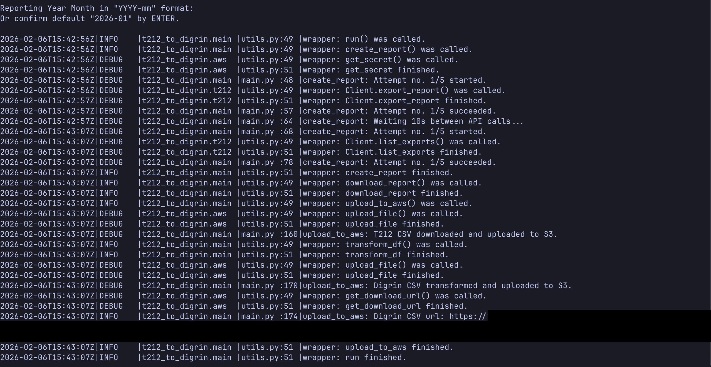

# T212 to Digrin

Custom automation script for Trading 212 portfolio analytics in Digrin.

Exports Trading 212 monthly report via rest API calls.
Monthly report is then transformed for Digrin and stored in AWS S3.
Can be run from CLI or AWS lambda.



1. Get input year_month (CLI only).
2. T212 rest API calls to gen export and list reports endpoints with creds stored in AWS Secrets Manager.
3. Download raw T212 CSV report and store it in AWS S3 via boto SDK.
4. Transform the report to Digrin form and store it in AWS S3 via boto SDK.
5. Generate S3 presigned URL for download via boto SDK (CLI only).

### Technical Overview

- [T212 rest API calls](https://docs.trading212.com/api)
- AWS services used - Secrets Manager, S3, Event Bridge Scheduler, Lambda, IAM
- Terraform IaC

### Run (CLI only)

**Requirements:** `aws configure --profile t212-to-digrin-cli`

```bash
uv run python -m t212_to_digrin
```
