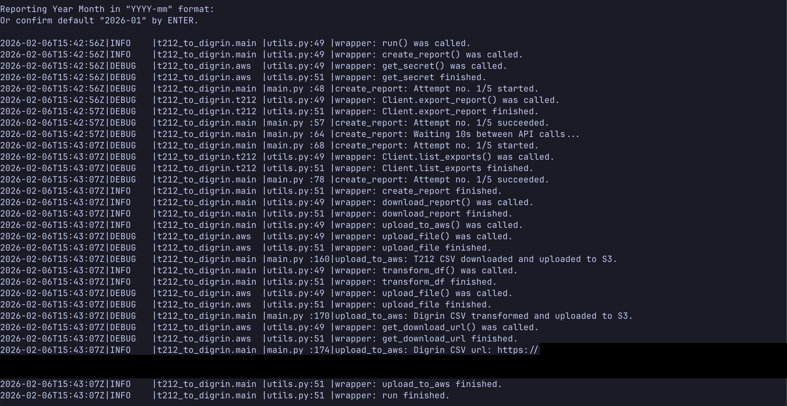

# T212 to Digrin

Python package for exporting T212 monthly report automation via rest API calls.
Monthly report is then transformed for Digrin and stored in AWS S3.

- run from CLI or AWS lambda.



1. Get input year_month (CLI only).
2. T212 export report endpoint.
3. Download CSV report, transform it and upload to S3.

## CLI

### Setup

**Requirements**:
- T212 api key (only all history perms) stored AWS Secrets Manager.
- AWS IAM role with perms:
  - S3 GetObject (need for presigned url)
  - S3 PutObject (needed to store csvs)
  - SecretsManager GetSecretValue
- `aws configure --profile t212-to-digrin-cli`

### Run

```bash
    uv run python -m t212_to_digrin
```

# TODO
- [x] add unit tests with mocking
- [x] format and lint
- [x] typechk
- [x] why is not get_input_dt logger? -> NOPE
- [x] warning / err log record formatting
- [x] presigned url only in CLI, lambda not
- [ ] deploy lambda gh action
- [ ] AWS tags, resource group, application (after terraform)
- [ ] cc like tui
